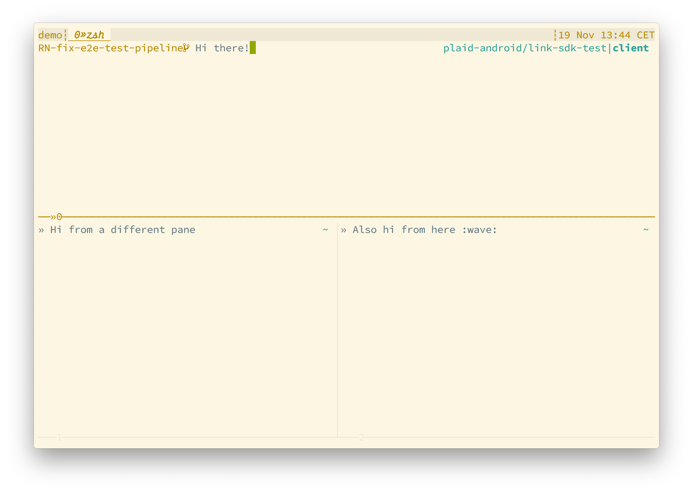

# zsh-config
Local configuration for zsh

Huge thanks to Alexis for helping me set this up and sharing [his configuration](https://github.plaid.com/ahildebrandt/dotfiles).

# Installation

## Tools/apps
Install the following tools/apps:

- [Alacritty](https://github.com/alacritty/alacritty) - version 0.6.0-rc2
- [tmux](https://github.com/tmux/tmux/wiki) - `brew install tmux`

## Fonts
Install the following fonts for all glyphs to work:

- https://github.com/ryanoasis/nerd-fonts/releases/download/v2.1.0/Hasklig.zip
- https://rubjo.github.io/victor-mono/

## Setup
- Checkout this repo into `~/.dotfiles`
- Run `setup.sh` to generate the symlinks
- Verify that the default shell is zsh `echo $SHELL`

# More information
- [Zsh documentation](http://zsh.sourceforge.net/Doc/)
- [Solarized theme](https://ethanschoonover.com/solarized/)
- `man zshall` for full `zsh` documentation
